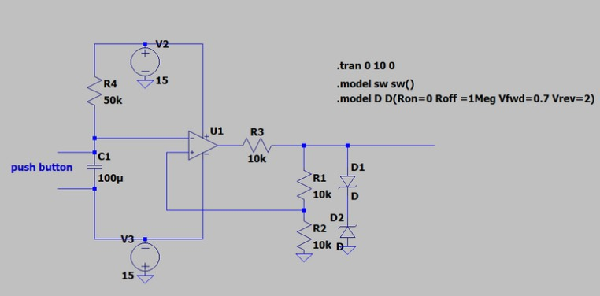

#  Monostable Multivibrator-Based Doorbell Circuit

This project demonstrates a doorbell circuit built using a monostable multivibrator. Designed with an op-amp, resistors, capacitors, and clamping diodes, the circuit generates a fixed-duration output pulse when a push button is pressed — simulating a real-world doorbell using an LED.

---

##  Project Objective

- Simulate a doorbell using analog hardware  
- Trigger a **single, time-controlled pulse** on button press  
- Use an LED to visualize the output duration  
- Apply basic op-amp circuit design principles

---

##  Components Used

- **Op-Amp** – LM741  
- **Resistors** – 10kΩ, 50kΩ  
- **Capacitor** – 100μF (electrolytic)  
- **Push Button** – Normally Open  
- **Zener Diodes** – 5.6V clamping (D1 & D2)  
- **Power Supply** – ±15V (dual rails)  
- **LED** – Optional for output display  
- **Breadboard and jumper wires**

---

##  Theory & Key Calculations

### Time Constant (Pulse Width)

The pulse width is determined by the RC time constant:
T = R4 × C1
= 50kΩ × 100μF
= 5 seconds

So, the output (e.g., LED) stays ON for approximately **5 seconds**.

---

###  Voltage Divider Threshold (β Factor)

Defines the switching point of the op-amp comparator:

β = R2 / (R1 + R2)
= 10k / (10k + 10k)
= 0.5

This results in the non-inverting input toggling between ±0.5 × Vsat.

---

### Zener Diode Clamping

- Two **5.6V Zener diodes** clamp the op-amp output  
- Limits voltage swing to **±5.6V**  
- Ensures safe and predictable output range  
- Protects any connected load (e.g., LED or microcontroller input)

---

## How It Works

1. Pressing the button triggers the capacitor to discharge, changing the op-amp state.  
2. The output goes high and remains so for the RC-defined duration.  
3. After the timeout, the capacitor charges back, resetting the op-amp state.  
4. Zener diodes clamp the output voltage, and the LED turns off.

---

## Circuit Diagram

The following is the monostable multivibrator-based doorbell circuit used in this project:

---

## Key Takeaways

- Monostable multivibrators are ideal for one-shot timing applications  
- Analog components can replicate digital timing behavior  
- Zener diodes effectively clamp analog outputs  
- Simple circuits can simulate useful real-world systems like a doorbell

---

## Authors

**Nishit Rupavatia**

---

